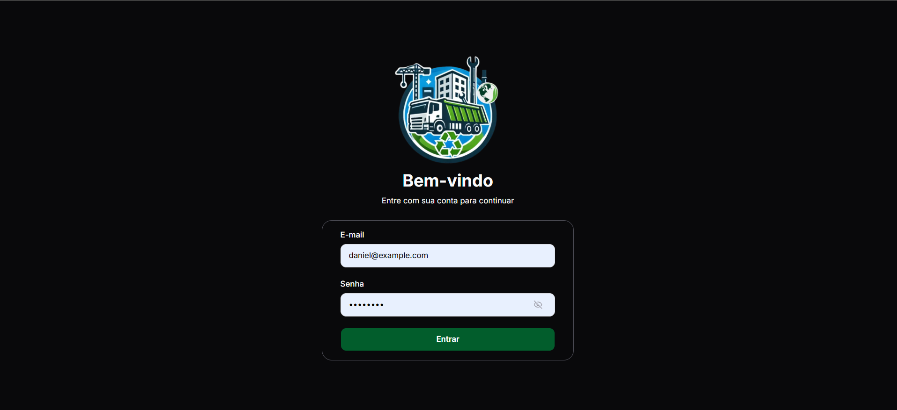
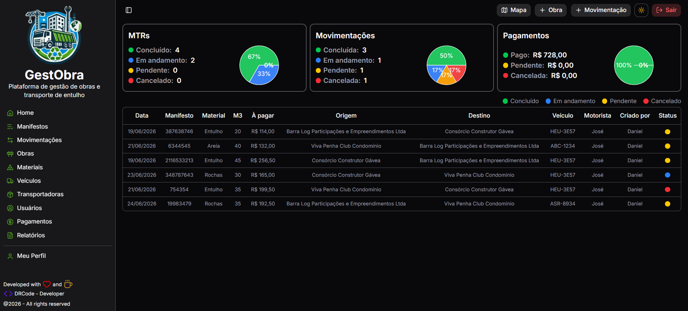
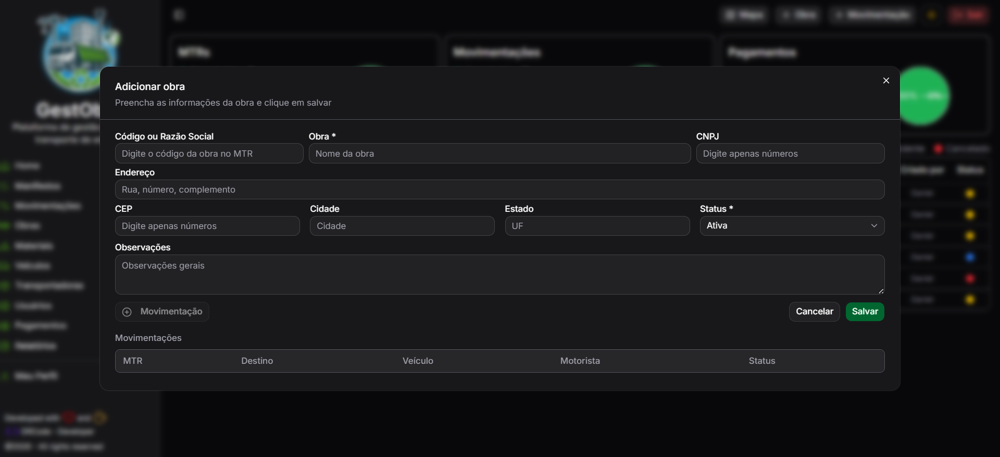
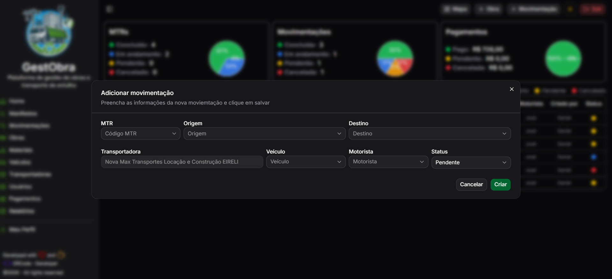
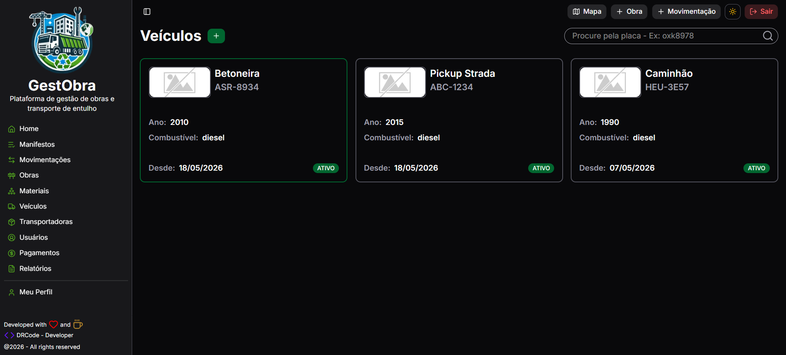
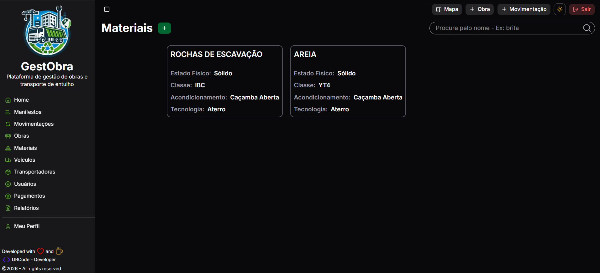
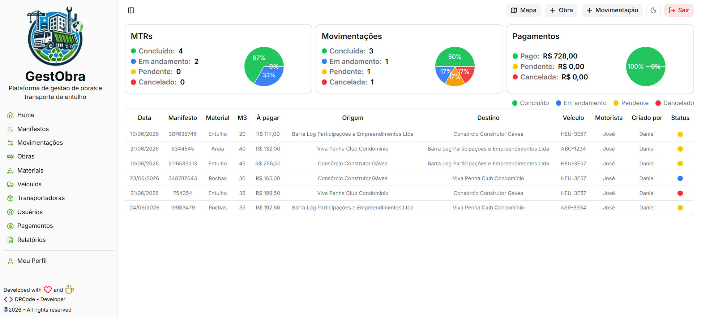

# 🚧 GestObra

Sistema web para gerenciamento de resíduos da construção civil, desenvolvido para automatizar o controle operacional da movimentação de resíduos, cadastro de entidades envolvidas e processamento financeiro dos transportes realizados.

> Projeto desenvolvido utilizando arquitetura moderna baseada em React, Next.js e TypeScript.

---

## 📷 Demonstração

<p align="center">
    
    
</p>

<p align="center">
    
    
</p>

<p align="center">
    
    
</p>

---

## 🌓 Modo Dark/Light

<p align="center">
    
    
</p>

---

## ✨ Principais funcionalidades

- Cadastro de obras
- Cadastro de empresas
- Cadastro de veículos
- Cadastro de materiais (resíduos)
- Cadastro de usuários/motoristas
- Cadastro/controle de movimentações
- Controle de pagamentos
- Dashboard com indicadores
- Autenticação de usuários
- Controle de permissões
- Interface responsiva

---

## 🛠 Tecnologias

Frontend

- Next.js
- React
- TypeScript
- TailwindCSS
- Shadcn UI
- React Hook Form
- React Query
- Axios
- Zod

Backend

- FastAPI
- SQLAlchemy
- PostgreSQL
- JWT

Infraestrutura

- Vercel
- Render.com
- Neon

---

## 🏗 Arquitetura

```
src
├── app/
│   ├── (auth)          # Autenticação
│   ├── dashboard/      # Dashboard
│   ├── companies/      # Empresas
│   ├── constructions/  # Obras
│   ├── transports/     # Transportes
│   ├── waste/          # Resíduos
│   └── finance/        # Financeiro
│
├── components/         # Componentes reutilizáveis
├── config/             # Comunicação com API
├── constants/          # Constantes
├── hooks/              # Hooks customizados
├── lib/                # Bibliotecas e helpers
├── providers/          # Contextos globais
├── schemas/            # Validações (Zod)
└── utils/              # Funções utilitárias
```

---

## 🚀 Executando localmente

Clone o projeto

```bash
git clone https://github.com/danielribas1105/gestobra-frontend
```

Entre na pasta

```bash
cd gestobra-frontend
```

Instale as dependências

```bash
npm install
```

Configure as variáveis

```env
NEXT_PUBLIC_API_URL=http://localhost:8000
```

Execute

```bash
npm run dev
```

---

## 📁 Estrutura de módulos

- Login
- Dashboard
- Obras
- Movimentações
- Empresas
- Transportadoras
- Veículos
- Materiais
- Pagamentos
- Usuários (Usuários e Motoristas)
- Relatórios

---

## 🔒 Segurança

- Autenticação JWT
- Rotas protegidas
- Controle de permissões
- Validação de formulários
- Sanitização de dados

---

## 📈 Melhorias futuras

- Notificações em tempo real
- Dashboard analítico
- Aplicativo mobile para validação das movimentações
- Integração com emissão de documentos
- Exportação avançada de relatórios

---

## 👨‍💻 Autor

Daniel Ribas

LinkedIn:
https://linkedin.com/in/danielribas-developer
